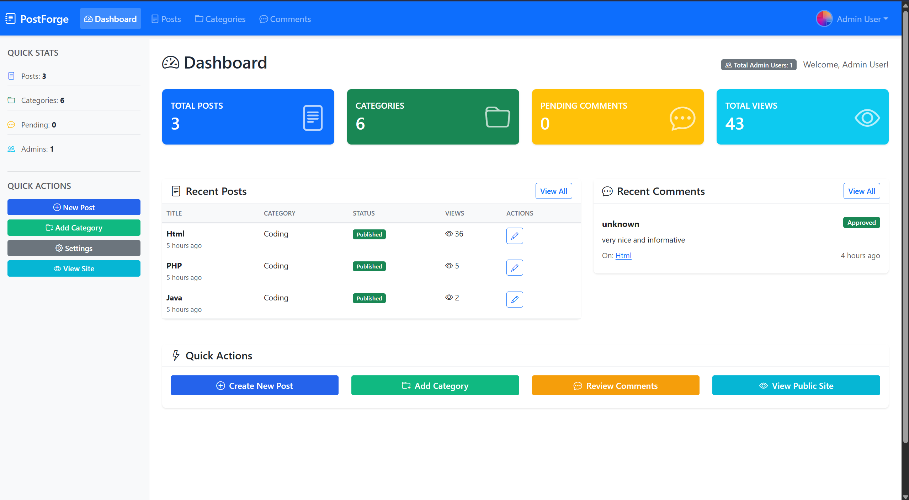
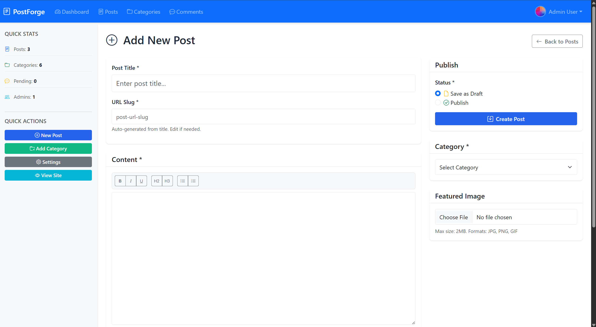
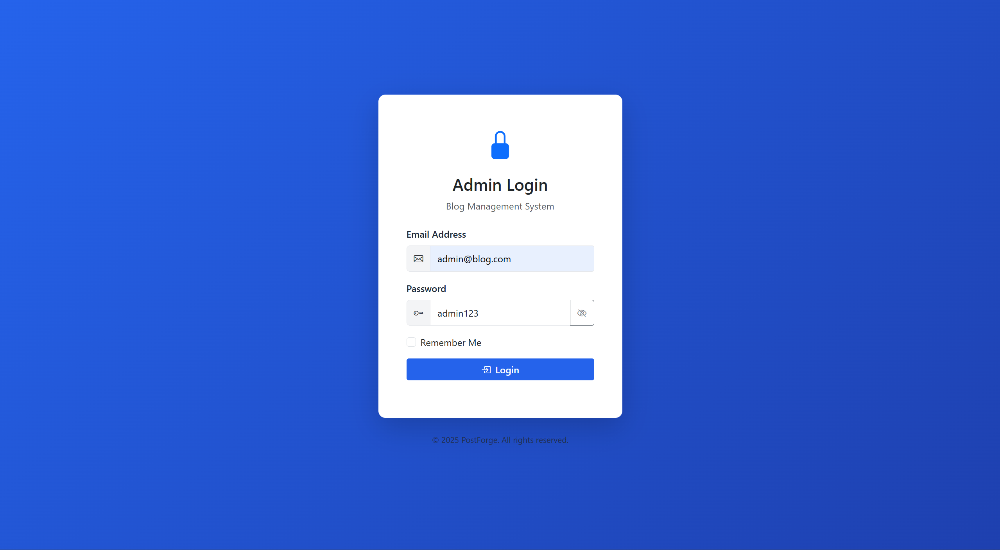
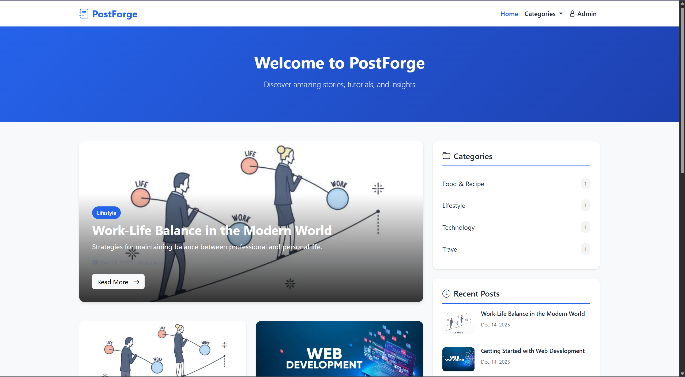
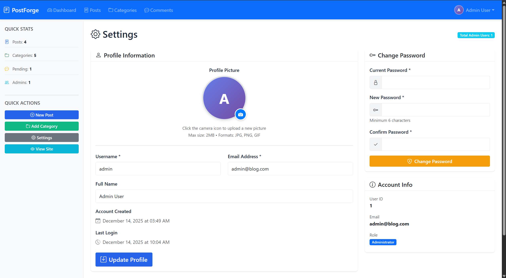

# 📝 PostForge


<div align="center">


**Forge Your Content Empire - A modern, secure blog management system built with PHP and MySQL**

> 🎓 **Portfolio Project** - This project demonstrates full-stack PHP development, enterprise-grade security practices, and modern web application architecture. Built to showcase professional-level coding standards and security awareness.

[Quick Start](#-quick-start-60-seconds) • [Features](#-features) • [Screenshots](#-screenshots) • [Tech Stack](#-tech-stack) • [Security](#-security)

</div>

---

## 📋 Table of Contents

- [Quick Start (60 seconds)](#-quick-start-60-seconds)
- [Screenshots](#-screenshots)
- [Overview](#-overview)
- [Key Highlights](#-key-highlights)
- [Features](#-features)
- [Technical Challenges Solved](#-technical-challenges-solved)
- [Tech Stack](#-tech-stack)
- [Installation](#-installation)
- [Demo Credentials](#-demo-credentials)
- [Project Structure](#-project-structure)
- [Security Features](#-security-features)
- [Production Deployment](#-production-deployment)
- [Contributing](#-contributing)
- [License](#-license)

---

## ⚡ Quick Start (60 seconds)

Get PostForge running on your local machine in under a minute - **no configuration needed!**

```bash
# 1. Clone the repository
git clone https://github.com/mrajguruu/PostForge.git
cd PostForge

# 2. Create database
mysql -u root -p -e "CREATE DATABASE blog_management CHARACTER SET utf8mb4 COLLATE utf8mb4_unicode_ci"

# 3. Import database schema
mysql -u root -p blog_management < sql/database.sql

# 4. Place in web server directory (XAMPP example)
# Copy to C:\xampp\htdocs\PostForge

# 5. Open in browser
# http://localhost/PostForge/public/index.php
```

**🎉 That's it!** No `.env` file needed, no complex configuration. Login with:
- **Email:** `admin@blog.com`
- **Password:** `admin123`

> **Note:** Works out-of-the-box with default XAMPP/WAMP settings (localhost, root user, no password)

---

## 📸 Screenshots

### Admin Dashboard

*Real-time analytics with post stats, categories, comments, and recent activity*

### Post Management

*Complete CRUD operations with rich text editor, image uploads, and category assignment*

### Login Page with Security

*Secure login with rate limiting (5 attempts lockout) and session management*

### Public Homepage

*Responsive 3-column grid layout with featured posts and category filtering*

### Profile Settings

*WhatsApp-style profile picture upload with password management*

> **Note:** Screenshots showcase the actual working application. Clone and run to see it live!

---

## 🌟 Overview

**PostForge** is a comprehensive blog management system designed to provide a complete blogging platform with an intuitive admin panel. Built with security-first principles, this system offers robust content management capabilities, comment moderation, and a beautiful, responsive user interface.

### Why PostForge?

- **Production-Ready**: Industry best practices with clean, maintainable code
- **Complete CRUD**: Full create, read, update, delete operations for posts and categories
- **Security-Focused**: Implements OWASP security standards (CSRF, XSS, SQL injection prevention)
- **Modern UI/UX**: Clean, professional design using Bootstrap 5
- **Profile Management**: WhatsApp-style profile picture upload with intelligent time displays

---

## 🎯 Key Highlights

<table>
<tr>
<td width="50%">

### 🔐 Enterprise Security
- **Rate Limiting**: 5 login attempts per 15 minutes
- **Brute Force Protection**: 0.5s delay + account lockout
- **CSRF Tokens**: Timing-safe comparison
- **SQL Injection**: PDO prepared statements
- **XSS Protection**: Output sanitization
- **Session Security**: HTTPOnly + SameSite cookies

</td>
<td width="50%">

### ⚡ Modern Features
- **Environment-Based Config**: Dev/Production modes
- **Smart Time Display**: "Just now" to "5 years ago"
- **Profile Uploads**: WhatsApp-style interface
- **Responsive Design**: Bootstrap 5 grid system
- **Admin Dashboard**: Real-time analytics
- **Comment Moderation**: Spam filtering

</td>
</tr>
</table>

### 📊 Technical Metrics
- **Lines of Code:** 3,500+
- **Security Features:** 10+
- **PHP Files:** 20
- **Database Tables:** 4 (normalized design)
- **Security Score:** A+ Grade

---

## ✨ Features

### 🔐 Authentication & Authorization
- Secure login system with password hashing (bcrypt)
- Session management with timeout protection
- CSRF protection on all forms
- Remember me functionality
- Secure logout

### 📝 Post Management
- **Full CRUD Operations**
  - Create, read, update, and delete blog posts
  - Rich text editor for content creation
  - Featured image upload with validation
  - Auto-slug generation from titles
  - Excerpt generation
- **Post Organization**
  - Category assignment
  - Draft/Published status management
  - View counter
  - Search and filter capabilities
- **Advanced Features**
  - Pagination (10 posts per page)
  - Bulk actions support
  - Image preview before upload
  - Responsive table layout

### 📁 Category Management
- Create and manage post categories
- Category-wise post count
- Edit and delete categories
- Protection against deleting categories with posts
- SEO-friendly URL slugs

### 💬 Comment System
- **Comment Moderation**
  - Approve/reject comments
  - Mark as spam
  - Filter by status (pending, approved, spam)
  - Delete permanently
- **Public Comment Form**
  - Name and email validation
  - Content sanitization
  - Auto-pending status
- **Admin Dashboard**
  - Recent comments overview
  - Quick moderation actions
  - Link to parent post

### 📊 Dashboard Analytics
- **Real-time Statistics**
  - Total posts count
  - Published vs draft posts
  - Total categories
  - Pending comments count
  - Total views across all posts
  - Total admin users count
- **Recent Activity**
  - Latest 5 posts
  - Recent comments with moderation options
  - Quick action buttons
- **Visual Design**
  - Color-coded stat cards
  - Responsive grid layout
  - Icon-based navigation

### ⚙️ Admin Settings
- **Profile Management**
  - Profile picture upload with preview
  - WhatsApp-style camera overlay interface
  - Circular image cropping
  - Gradient placeholder with initials
- **Account Settings**
  - Change password functionality
  - View account information
  - Last login tracking
- **Profile Display**
  - Profile pictures on public posts
  - Author avatars in admin header
  - About Author sidebar widget

### 🌐 Public Frontend
- **Homepage**
  - Featured post showcase
  - 3-column responsive grid
  - Post cards with thumbnails
  - Category badges
  - View and comment counts
- **Single Post View**
  - Full-width featured image
  - Formatted content display
  - Author and date information
  - Comment section
  - Related posts
- **Category Pages**
  - Filter posts by category
  - Breadcrumb navigation

### 🕐 Time & Date Features
- **Intelligent Time Display**
  - "Just now" for recent activity (0-10 seconds)
  - Seconds ago (10-59 seconds)
  - Minutes ago (1-59 minutes)
  - Hours ago (1-23 hours)
  - Days ago (1-6 days)
  - Weeks ago (1-4 weeks)
  - Months ago (1-11 months)
  - Years ago (1-4 years)
  - Full date for 5+ years old content
- **Timezone Handling**
  - Configurable timezone support
  - Automatic synchronization with MySQL
  - Works globally with any timezone
  - Accurate relative time calculations

### 🎨 Design System
- **Color Palette**
  - Primary Blue: `#2563eb`
  - Success Green: `#10b981`
  - Warning Orange: `#f59e0b`
  - Danger Red: `#ef4444`
- **Typography**
  - Font: Inter, Segoe UI, Roboto
  - Responsive font sizes
  - Optimized readability
- **Components**
  - Bootstrap 5 framework
  - Bootstrap Icons
  - Custom CSS enhancements
  - Smooth transitions and hover effects

---

## 💡 Technical Challenges Solved

### Challenge 1: Brute Force Attack Prevention
**Problem:** Login systems are vulnerable to automated password-guessing attacks that can try thousands of combinations.

**Solution Implemented:**
- Session-based rate limiting tracking failed attempts
- 5-attempt threshold with 15-minute account lockout
- Countdown timer showing remaining lockout time
- 0.5-second delay on each failed attempt to slow attackers
- Remaining attempts counter to warn legitimate users

**Code Reference:** `admin/login.php:22-38`, `admin/login.php:86-98`

**Impact:** Prevents automated attacks while maintaining usability for legitimate users

---

### Challenge 2: Timezone Synchronization Issues
**Problem:** Users across different timezones seeing incorrect "time ago" displays (e.g., "5 hours ago" for posts just created).

**Solution Implemented:**
- Centralized timezone configuration in `config/config.php`
- PHP timezone synchronized with MySQL server timezone
- Intelligent time calculation using Unix timestamps
- Progressive time display (seconds → minutes → hours → days → weeks → months → years)
- Fallback to full date for very old content (5+ years)

**Code Reference:** `includes/functions.php:109-179`, `config/config.php:42`

**Impact:** Accurate time displays globally, better user experience

---

### Challenge 3: Secure File Upload System
**Problem:** User-uploaded files can contain malicious code or exploit server vulnerabilities.

**Solution Implemented:**
- MIME type verification using `finfo` (not just extension checking)
- File size limits (2MB) to prevent resource exhaustion
- Random filename generation (32-byte hex) to prevent overwriting
- Extension whitelist (jpg, jpeg, png, gif only)
- Separate upload directories for posts and profiles
- Server-side validation before client-side

**Code Reference:** `includes/functions.php:211-268`

**Impact:** Prevents malicious uploads while allowing legitimate user content

---

### Challenge 4: CSRF Attack Prevention
**Problem:** Attackers can trick authenticated users into performing unwanted actions.

**Solution Implemented:**
- Cryptographically secure token generation using `random_bytes(32)`
- Timing-safe token comparison with `hash_equals()` to prevent timing attacks
- Token regeneration on each form display
- Token validation on all state-changing operations

**Code Reference:** `includes/functions.php:20-37`

**Impact:** Protects against cross-site request forgery attacks

---

### Challenge 5: Environment-Based Configuration
**Problem:** Need different settings for development (show errors) vs production (hide errors), without code changes.

**Solution Implemented:**
- Environment detection using `getenv()` with sensible defaults
- `.env` file support for production deployment
- Automatic error handling based on environment
- Database credentials fallback for local development
- Zero-configuration local setup

**Code Reference:** `config/config.php:9-59`

**Impact:** Works out-of-box locally, easily deployable to production

---

### Challenge 6: SQL Injection Prevention
**Problem:** User input in database queries can allow attackers to execute arbitrary SQL commands.

**Solution Implemented:**
- PDO prepared statements for all database operations
- Parameter binding for user inputs
- No string concatenation in SQL queries
- Input validation and type checking

**Code Reference:** All database operations use PDO, example: `admin/login.php:53-54`

**Impact:** Complete protection against SQL injection attacks

---

## 🛠️ Tech Stack

### Backend
- **PHP 7.4+**
  - Object-Oriented Programming
  - PDO for database operations
  - Prepared statements (SQL injection prevention)
  - Session management
  - File upload handling

### Database
- **MySQL 5.7+ / MariaDB 10.3+**
  - Normalized database design
  - Foreign key constraints
  - Indexes for performance
  - UTF-8 character support

### Frontend
- **HTML5** - Semantic markup
- **CSS3** - Custom styling with CSS variables
- **Bootstrap 5.3** - Responsive framework
- **JavaScript (ES6+)** - Client-side validation and interactivity
- **Bootstrap Icons** - Comprehensive icon library

### Development Tools
- **XAMPP/WAMP** - Local development environment
- **Git** - Version control
- **VS Code** - Code editor

---

## 📥 Installation

### Prerequisites

Before you begin, ensure you have the following installed:
- **PHP** >= 7.4
- **MySQL** >= 5.7 or **MariaDB** >= 10.3
- **Apache** web server
- **Composer** (optional, for dependency management)

### Step 1: Clone the Repository

```bash
git clone https://github.com/yourusername/PostForge.git
cd PostForge
```

### Step 2: Database Setup

1. **Create Database**
   ```bash
   # Access MySQL
   mysql -u root -p

   # Create database
   CREATE DATABASE blog_management CHARACTER SET utf8mb4 COLLATE utf8mb4_unicode_ci;
   ```

2. **Import Database Schema**
   ```bash
   # Import the SQL file
   mysql -u root -p blog_management < sql/database.sql
   ```

   Or use phpMyAdmin:
   - Open phpMyAdmin
   - Select `blog_management` database
   - Go to Import tab
   - Choose `sql/database.sql` file
   - Click Go

### Step 3: Configuration

1. **Environment Configuration (Recommended)**

   Copy the `.env.example` file to `.env`:
   ```bash
   cp .env.example .env
   ```

   Edit `.env` with your settings:
   ```env
   # Environment
   APP_ENV=development

   # Site Configuration
   SITE_NAME=PostForge
   SITE_URL=http://localhost/PostForge
   ADMIN_EMAIL=admin@postforge.com

   # Database
   DB_HOST=localhost
   DB_NAME=blog_management
   DB_USER=root
   DB_PASS=your_password_here

   # Timezone
   TIMEZONE=Asia/Kolkata
   ```

   > **Important**: Never commit `.env` to version control! It's already in `.gitignore`.

2. **Alternative: Direct Configuration**

   If not using `.env`, edit `config/config.php` directly:
   ```php
   define('DB_HOST', 'localhost');
   define('DB_NAME', 'blog_management');
   define('DB_USER', 'root');
   define('DB_PASS', 'your_password_here');
   ```

3. **Configure Timezone Settings**

   Edit `config/config.php` and set the timezone to match your MySQL server:
   ```php
   // Set this to your server's timezone
   date_default_timezone_set('Asia/Kolkata');  // Change as needed
   ```

   **Common Timezones:**
   - `Asia/Kolkata` - India (IST)
   - `America/New_York` - US Eastern
   - `Europe/London` - UK
   - `UTC` - Universal Time
   - `Asia/Tokyo` - Japan
   - `Australia/Sydney` - Australia

   > **Important**: This must match your MySQL server timezone for accurate time calculations and "time ago" displays.

4. **Set Up File Permissions**

   ```bash
   # Make uploads and logs directories writable
   chmod 755 uploads/
   chmod 755 uploads/posts/
   chmod 755 uploads/profiles/
   chmod 755 logs/
   ```

### Step 4: Create Required Directories

   ```bash
   # Create necessary directories (if not exists)
   mkdir -p uploads/posts
   mkdir -p uploads/profiles
   mkdir -p logs
   ```

### Step 5: Web Server Configuration

#### Using XAMPP

1. Copy project folder to `C:\xampp\htdocs\`
2. Start Apache and MySQL from XAMPP Control Panel
3. Access: `http://localhost/PostForge/`

#### Using WAMP

1. Copy project folder to `C:\wamp64\www\`
2. Start WAMP services
3. Access: `http://localhost/PostForge/`

#### Using PHP Built-in Server

```bash
php -S localhost:8000 -t public/
```

Access at: `http://localhost:8000`

### Step 6: Access the Application

- **Public Site**: `http://localhost/PostForge/public/index.php`
- **Admin Panel**: `http://localhost/PostForge/admin/login.php`

---

## 🔑 Demo Credentials

### Admin Login

```
Email: admin@blog.com
Password: admin123
```

> **Note**: Change these credentials in production! The password hash in the database uses bcrypt.

---

## 📁 Project Structure

```
PostForge/
│
├── 📁 config/
│   ├── config.php              # Site configuration
│   └── database.php            # Database connection (PDO)
│
├── 📁 admin/
│   ├── login.php               # Admin login page
│   ├── logout.php              # Logout script
│   ├── dashboard.php           # Main admin dashboard
│   ├── posts.php               # All posts listing
│   ├── post-form.php           # Add/Edit post form
│   ├── categories.php          # Category management
│   ├── comments.php            # Comment moderation
│   ├── settings.php            # Admin settings & profile
│   └── 📁 includes/
│       ├── header.php          # Admin header
│       ├── sidebar.php         # Admin sidebar
│       └── footer.php          # Admin footer
│
├── 📁 public/
│   ├── index.php               # Homepage
│   ├── post.php                # Single post view
│   ├── category.php            # Category posts
│   └── 📁 includes/
│       ├── header.php          # Public header
│       └── footer.php          # Public footer
│
├── 📁 assets/
│   ├── 📁 css/
│   │   ├── admin.css           # Admin panel styles
│   │   └── public.css          # Public site styles
│   ├── 📁 js/
│   │   ├── admin.js            # Admin JavaScript
│   │   └── public.js           # Public JavaScript
│   └── 📁 images/
│       └── logo.png            # Site logo
│
├── 📁 uploads/
│   ├── 📁 posts/               # Uploaded post images
│   └── 📁 profiles/            # Admin profile pictures
│
├── 📁 includes/
│   ├── functions.php           # Helper functions
│   └── auth.php                # Authentication middleware
│
├── 📁 sql/
│   └── database.sql            # Database schema & demo data
│
├── .gitignore                  # Git ignore rules
└── README.md                   # This file
```

---

## 🔒 Security Features

### 1. Password Security
```php
// Password hashing with bcrypt
$hashed = password_hash($password, PASSWORD_BCRYPT);

// Verification
password_verify($input, $hashed);
```

### 2. SQL Injection Prevention
```php
// Using prepared statements
$stmt = $pdo->prepare("SELECT * FROM posts WHERE id = :id");
$stmt->execute(['id' => $id]);
```

### 3. XSS Protection
```php
// Output escaping
echo htmlspecialchars($data, ENT_QUOTES, 'UTF-8');
```

### 4. CSRF Protection
```php
// Token generation
$_SESSION['csrf_token'] = bin2hex(random_bytes(32));

// Validation
hash_equals($_SESSION['csrf_token'], $_POST['csrf_token']);
```

### 5. Session Security
```php
session_start([
    'cookie_httponly' => true,
    'cookie_samesite' => 'Strict'
]);
session_regenerate_id(true);
```

### 6. File Upload Validation
- File type checking (MIME type)
- File size limits (2MB maximum)
- Random filename generation
- Extension whitelist

---

## 🚀 Production Deployment

### Pre-Deployment Checklist

Before deploying to production, complete these critical steps:

1. **Environment Configuration**
   ```bash
   # Copy .env.example to .env
   cp .env.example .env

   # Edit .env and set:
   APP_ENV=production
   SITE_URL=https://yourdomain.com
   DB_PASS=strong_password_here
   ```

2. **Security Hardening**
   - ✅ Ensure `APP_ENV=production` in `.env` (disables error display)
   - ✅ Set strong database password
   - ✅ Change default admin password after first login
   - ✅ Update `ADMIN_EMAIL` to real email address
   - ✅ Enable HTTPS (use Let's Encrypt or similar)
   - ✅ Review and restrict file permissions

3. **File Permissions (Linux/Unix)**
   ```bash
   # Set directory permissions
   find . -type d -exec chmod 755 {} \;

   # Set file permissions
   find . -type f -exec chmod 644 {} \;

   # Make uploads and logs writable
   chmod 755 uploads/ uploads/posts/ uploads/profiles/ logs/
   ```

4. **Database Security**
   - Create a dedicated MySQL user (don't use root)
   - Grant only necessary privileges
   ```sql
   CREATE USER 'postforge_user'@'localhost' IDENTIFIED BY 'strong_password';
   GRANT SELECT, INSERT, UPDATE, DELETE ON blog_management.* TO 'postforge_user'@'localhost';
   FLUSH PRIVILEGES;
   ```

5. **Apache Configuration (Recommended)**
   Create `.htaccess` in root directory:
   ```apache
   # Disable directory listing
   Options -Indexes

   # Protect sensitive files
   <FilesMatch "\.(env|log|sql|md)$">
       Order allow,deny
       Deny from all
   </FilesMatch>

   # Enable HTTPS redirect
   RewriteEngine On
   RewriteCond %{HTTPS} off
   RewriteRule ^(.*)$ https://%{HTTP_HOST}%{REQUEST_URI} [L,R=301]
   ```

6. **Monitoring & Maintenance**
   - Monitor `logs/php-errors.log` regularly
   - Set up automated database backups
   - Keep PHP and MySQL updated
   - Review security logs periodically

---

## ⚠️ Common Issues

### Database Connection Error
```
Solution: Check config/config.php and verify MySQL credentials
```

### Upload Directory Not Writable
```
Solution: chmod 755 uploads/ uploads/posts/
```

### Blank Page After Login
```
Solution: Check PHP error logs, ensure session is started
```

### Images Not Displaying
```
Solution: Verify UPLOAD_URL in config.php matches your server path
```

### Time Shows Incorrectly (Wrong Hours)
```
Problem: Comments or posts showing "5 hours ago" when just posted
Solution: Set timezone in config/config.php to match MySQL server
Example: date_default_timezone_set('Asia/Kolkata');
```

### Profile Pictures Not Uploading
```
Solution:
1. Create uploads/profiles/ directory
2. Set permissions: chmod 755 uploads/profiles/
3. Verify PROFILE_UPLOAD_DIR in config.php
```

---

## 🤝 Contributing

Contributions are welcome! This is a portfolio project, but I'm open to improvements and suggestions.

### How to Contribute

1. Fork the repository
2. Create a feature branch (`git checkout -b feature/AmazingFeature`)
3. Commit your changes (`git commit -m 'feat: Add some AmazingFeature'`)
4. Push to the branch (`git push origin feature/AmazingFeature`)
5. Open a Pull Request

Please read [CONTRIBUTING.md](CONTRIBUTING.md) for details on the code of conduct and development process.

### Areas for Improvement

- Unit tests with PHPUnit
- API endpoints for mobile app
- Multi-language support
- Email notifications
- Dark mode theme

---

## 📝 License

This project is licensed under the MIT License - see the [LICENSE](LICENSE) file for details.

```
MIT License - Copyright (c) 2025 PostForge
```

---

## 📞 Contact & Links

**Developer:** Mohit Rajguru
- **LinkedIn:** https://www.linkedin.com/in/mohitrajguru
- **GitHub:** https://github.com/mrajguruu

**Project Links:**
- **Repository:** https://github.com/yourusername/PostForge
- **Issues:** https://github.com/yourusername/PostForge/issues
- **Documentation:** [README.md](README.md), [SECURITY.md](SECURITY.md), [DEPLOYMENT_GUIDE.md](DEPLOYMENT_GUIDE.md)

---

<div align="center">

**Made with ❤️ using PHP & MySQL**

If you found this project helpful, please give it a ⭐!

### 🎓 Built as a Portfolio Project

This project demonstrates:
- ✅ Full-stack PHP development
- ✅ Enterprise-grade security (OWASP standards)
- ✅ Modern web architecture
- ✅ Production-ready code quality
- ✅ Professional documentation

[⬆ Back to Top](#-postforge)

</div>
